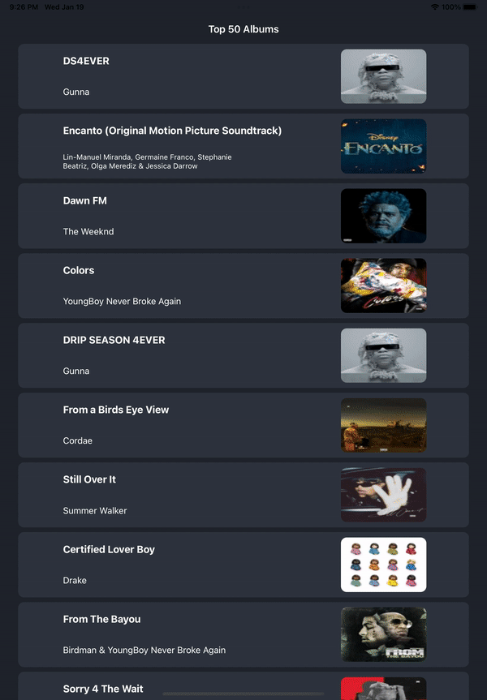

# AlbumShowcase

I made this in the same afternoon it was given to me, hopefully that is taken into consideration!

App using SwiftUI and MVVM Architecture to extract the top 50 albums on itunes and show information about each on a detail screen.

Project requirements said 100 but there was no such option in the API

## Footage on iPhone

## Footage on iPad(using simulator, therefore it just goes to safari since simulator has no app for music etc)

